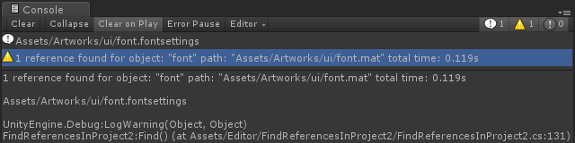

# Find References In Project 2

Find asset references super fast in Unity project. Both on macOS and Windows.

## Usage

1. Select asset in Project view and click `Ctrl+Shfit+F`.
2. Right click asset in Project view and select `Find References In Project` in popup menu.

## Feature

1. It's super fast on macOS and Windows if using SSD.
1. Show searching progress, max waiting time is 300s.
2. Show every reference in Console and you can click message to select object.
3. Show result in warning and summarize all references.

## Speed

### macOS

It only takes less than 2 seconds to complete search, it uses mdfind to utilize Spotlight index to speed up searching.

### Windows

It use the fastest `ripgrep` to search text and do a lot of optimization on file size and count.

So it would takes about 5 seconds to search ~700M and ~7000 files on SSD.

## Install

1. Clone repository into `Assets/Editor` directory.
2. Download `ripgrep` from [Latest release · BurntSushi/ripgrep](https://github.com/BurntSushi/ripgrep/releases/latest) and extract `rg.exe` to `Tools\FindReferencesInProject2` directory.
3. Click `Unlock file` in `rg.exe` Properties, or you will find it takes too long time to start first time.

Note: It seems that `x86_64-pc-windows-msvc` has a smaller size in `ripgrep` release page.

[How to remove file unlock in file properties.](https://social.technet.microsoft.com/Forums/en-US/086b25dd-803e-47cd-b2a6-8086c529577d/how-to-remove-file-unlock-in-file-properties?forum=winserverGP)

## Environment

- Windows 10
- macOS 10.13.6 and 10.14
- Unity 2017.4.2f2 and 2018.2.0f2
- ripgrep 0.10.0

## Acknowledgement

- [Unity editor extension that uses spotlight on OSX for lightning fast project reference searches. Asset serialization mode should be set to "Force Text" in the editor settings.](https://gist.github.com/jringrose/617d4cba87757591ce28)
- [BurntSushi/ripgrep: ripgrep recursively searches directories for a regex pattern](https://github.com/BurntSushi/ripgrep)
